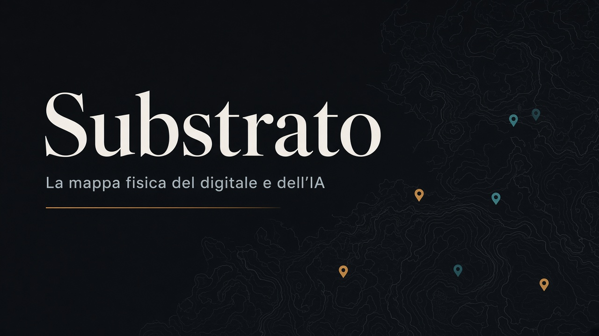

# Substrato

**L'infrastruttura invisibile** — mappa interattiva dell'infrastruttura fisica dietro servizi digitali e intelligenza artificiale (energia, data center, chip, miniere, lavoro), con focus su Italia ed Europa.

**Sito:** [substrato.eu](https://substrato.eu)



## Stack

- [Astro](https://astro.build/) (sito statico)
- [MapLibre GL](https://maplibre.org/) (mappa)
- Pipeline Node per ingest e merge GeoJSON
- Deploy su Netlify

## Avvio locale

Requisiti: Node.js 20+

```bash
npm install
npm run dev
```

Build di produzione:

```bash
npm run build
npm run preview
```

## Dati

La mappa legge i GeoJSON da `public/data/`.

| Cartella | Ruolo |
| --- | --- |
| `data/curated/` | Fonte di verità editoriale (record verificati a mano) |
| `data/candidates/` | Candidati normalizzati dalle fonti automatiche |
| `data/sources/` | Dump grezzi (WRI, OSM, DataCentersExposed, Aqueduct, …) |
| `public/data/` | Output servito dal sito (+ overlay di contesto) |

### Pipeline

```bash
# Singoli step
npm run data:fetch:wri        # impianti energetici (WRI)
npm run data:fetch:osm        # data center (OpenStreetMap / Overpass)
npm run data:fetch:dc         # DataCentersExposed (US)
npm run data:fetch:aqueduct   # stress idrico (Aqueduct)
npm run data:normalize        # → data/candidates/
npm run data:merge            # curated + candidates → public/data/
npm run data:overlays         # overlay locali (acqua, cavi, …)

# Tutto insieme
npm run data:refresh
```

Per aggiungere o correggere un sito: modifica i GeoJSON in `data/curated/`, poi `npm run data:merge`.  
Guida al modello dati: `src/data/README.ts` e `data/curated/README.md`.

### Fonti principali

- **WRI Global Power Plant Database** — CC BY 4.0
- **OpenStreetMap** (data center via Overpass) — ODbL
- **DataCentersExposed** — ODbL 1.0
- **Aqueduct 4.0 × HydroBASINS** — stress idrico
- Overlay rete elettrica: tile live [OpenInfraMap](https://openinframap.org/)

Dettagli e workflow: `data/sources/README.md`.

## Licenza

Codice e progetto: [AGPL-3.0](LICENSE).

I dataset di terze parti restano sotto le rispettive licenze indicate sopra e in `public/data/dataset_meta.json`.

## Segnalazioni

Errori, siti mancanti o aggiornamenti: [substrato.eu/segnala](https://substrato.eu/segnala).
